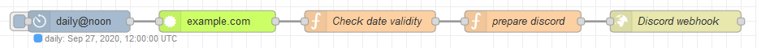

# node-red-contrib-ssl-certificate

A node to retrieve certificate information from a web server.

## Getting started

### Installation

<!--
Install via Node-RED Manage Palette

    node-red-contrib-ssl-certificate
-->

Install via npm

    $ cd ~/.node-red
    $ npm install node-red-contrib-ssl-certificate
    # then restart node-red

### Usage

Add the node to your flow. Provide a web server to check either via the configuration or optionally via 
`msg.server` on the incoming message.

Optionally set a port to connect to either through the configuration or via `msg.port`.

Once triggered the node will perform a web request to the specified server on the specified port and retrieve
the certificate information. It will then provide the parsed [certificate object](https://nodejs.org/api/tls.html#tls_certificate_object) on `msg.payload` for
further processing, as well as the valid from and valid to dates as `msg.valid_from` and `msg.valid_to`.

Also see the node's built-in documentation.

### Example flow

This flow requires [cron-plus](https://flows.nodered.org/node/node-red-contrib-cron-plus) to be installed as well. 
It will run a certificate check of "example.com" each day at noon UTC and warn via a Discord webhook if the 
certificate is about to expire within the next 14 days or already has expired.



``` json
[{"id":"2b30354f.61e9ba","type":"tab","label":"Flow 1","disabled":false,"info":""},{"id":"97e9dc85.9d1978","type":"http request","z":"2b30354f.61e9ba","name":"Discord webhook","method":"POST","ret":"txt","paytoqs":"ignore","url":"https://discordapp.com/api/webhooks/...","tls":"","persist":false,"proxy":"","authType":"","x":950,"y":60,"wires":[[]]},{"id":"6c9041fb.a85fc8","type":"function","z":"2b30354f.61e9ba","name":"prepare discord","func":"let text;\n\nif (msg.payload == \"expired\") {\n    text = \"The certificate of \" + msg.server + \" has expired!\";\n    color = 16711680;\n} else if (msg.payload == \"expires_soon\") {\n    text = \"The certificate of \" + msg.server + \" will expire soon, check renew.\";\n    color = 16776960;\n} else {\n    return;\n}\n\nreturn {\n    payload: {\n        embeds: [{\n            title: text,\n          color: color\n        }]\n    }\n}\n","outputs":1,"noerr":0,"initialize":"","finalize":"","x":740,"y":60,"wires":[["97e9dc85.9d1978"]]},{"id":"168411f5.7aef96","type":"function","z":"2b30354f.61e9ba","name":"Check date validity","func":"const days = 14 * 24 * 60 * 60 * 1000;\nconst now = new Date().getTime();\n\nconst valid_from = msg.valid_from.getTime();\nconst valid_to = msg.valid_to.getTime();\n\nif (now > valid_to) {\n    msg.payload = \"expired\";\n} else if (now + days > valid_to) {\n    msg.payload = \"expires_soon\";\n} else if (now < valid_from) {\n    msg.payload = \"not_yet_valid\";\n} else {\n    msg.payload = \"valid\";\n}\nreturn msg;","outputs":1,"noerr":0,"initialize":"","finalize":"","x":530,"y":60,"wires":[["6c9041fb.a85fc8"]]},{"id":"b4ab6e8d.61d578","type":"ssl-certificate","z":"2b30354f.61e9ba","name":"","server":"example.com","x":320,"y":60,"wires":[["168411f5.7aef96"]]},{"id":"ad0cf6d8.711538","type":"cronplus","z":"2b30354f.61e9ba","name":"daily@noon","outputField":"payload","timeZone":"","persistDynamic":false,"commandResponseMsgOutput":"output1","outputs":1,"options":[{"name":"daily","topic":"daily","payloadType":"default","payload":"","expressionType":"cron","expression":"0 0 12 * * *","location":"","offset":"0","solarType":"all","solarEvents":"sunrise,sunset"}],"x":130,"y":60,"wires":[["b4ab6e8d.61d578"]]}]
```

## License

[MIT](LICENSE.md)

## Acknowledgements

Makes use of [get-ssl-certificate](https://github.com/johncrisostomo/get-ssl-certificate) by @johncrisostomo.
